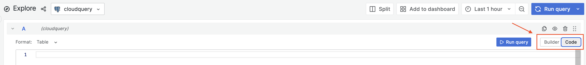
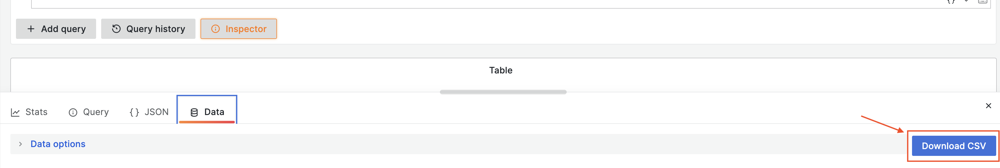

# repository-yodeller

`repository-yodeller` is a tool to ease sending one-off emails via anghammarad to various teams in the department to alert them of any required actions on their repos. For example you could use this tool for:
 - Deprecating a library and letting teams know which repositories they own need action.
 - Informing teams of a major release and providing migration instructions, for example Play 3.0.

## Prerequesites

    - Deno
    - NPM
    - Access to an AWS account with Anghammarad enabled

## Usage

### 1. Preparing the data

`repository-yodeller` expects a CSV file called `data.csv` in the root dir to let it know which teams and repositories to message, there is an example file included with this repository. **Do not include headers in this file**, the first column should be the repository name, and the 2nd column should be the name of the github team that should be notified.

You may find it useful to use Grafana & CloudQuery to prepare this data
  1. Head to the [Explore view](https://metrics.gutools.co.uk/explore) in Grafana
  2. Select "cloudquery" as your Datasource
  3. Switch to the "Code" view 
  4. Write your query, you can look at [QUERY.MD](QUERY.MD) as an example query on finding repositories with a deprecated library
  5. Download the query results as a CSV from the "Inspector" view.
  6. **Remove the header (first line) of the CSV file** and place it in the root folder of `repository-yodeller` as `data.csv`

### 2. Preparing the template

Edit the `TEMPLATE.md` file with your message, Anghammarad does have support for some Markdown so feel free to format to your hearts desire. The first line of this file is used as the "subject".

### 3. Generating and sending messages

Once you've prepared your data and template you can run `npm run prepare-messages`, this will create a new `messages/` folder where you can preview your message before it gets sent to all teams.

If you're happy with the prepared messages run `AWS_PROFILE=(your AWS profile) npm run send-messages` to send your messages off to Anghammarad, teams should start getting notified immediately!
